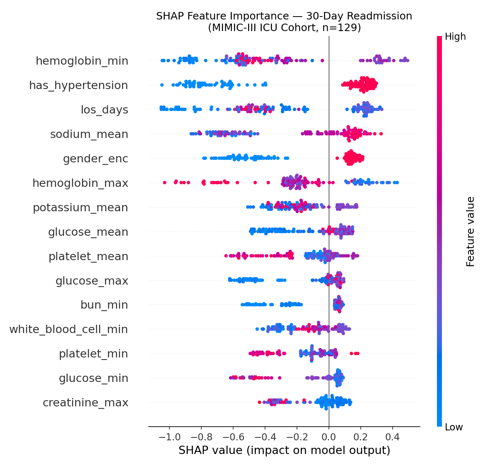
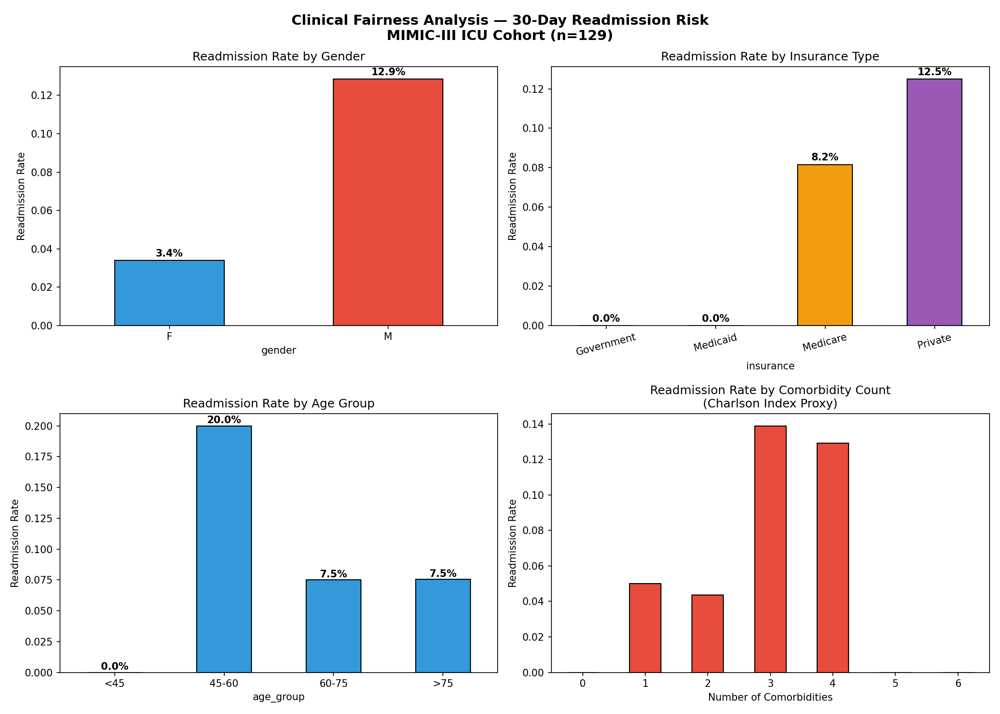
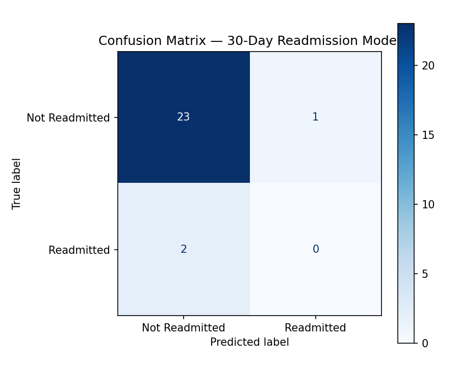

# 🏥 Patient Readmission Risk & Clinical Dashboard
> Clinical data science pipeline predicting 30-day hospital readmission using MIMIC-III ICU data, with fairness auditing and an interactive Streamlit dashboard.

**Dataset:** MIMIC-III Clinical Database Demo — MIT Laboratory for Computational Physiology  
**Citation:** Johnson et al. (2016). MIMIC-III, a freely accessible critical care database. *Scientific Data*, 3, 160035.

---

## 🎯 Project Overview

Hospital readmission within 30 days is a key quality metric tracked by the Centers for Medicare & Medicaid Services (CMS). Hospitals face financial penalties for excess readmissions. This project builds an end-to-end clinical risk scoring system using real de-identified ICU data.

**Pipeline:**
```
MIMIC-III EHR Data (SQL tables)
        ↓
Feature Engineering
(Demographics + ICD-9 Comorbidities + 9 Lab Biomarkers)
        ↓
XGBoost + Leave-One-Out CV
        ↓
SHAP Explainability + Fairness Audit
        ↓
Streamlit Clinical Risk Dashboard
```

---

## 📊 Key Results

### SHAP Feature Importance


### Clinical Fairness Audit


### Model Evaluation


---

## 🔍 Key Clinical Findings

| Finding | Clinical Implication |
|---|---|
| **Hemoglobin** is top predictor | Anemia at discharge → impaired recovery → readmission |
| **Males 12.9% vs Females 3.4%** readmission | Gender disparity in discharge planning |
| **45-60 age group highest risk (20%)** | Counter-intuitive — mid-age patients underserved |
| **3-4 comorbidities = peak risk (13-14%)** | Charlson Index validated as risk tool |
| **Private insurance 12.5% vs Medicaid 0%** | Socioeconomic complexity in post-discharge support |

---

## 🛠️ Tech Stack

| Layer | Tools |
|---|---|
| **Data** | MIMIC-III (real de-identified ICU EHR data) |
| **Feature Engineering** | ICD-9 comorbidity mapping, lab biomarker extraction, Charlson Index proxy |
| **Modeling** | XGBoost, Leave-One-Out CV (clinically appropriate for small cohorts) |
| **Explainability** | SHAP (TreeExplainer) |
| **Fairness** | Demographic subgroup audit (gender, insurance, age, ethnicity) |
| **Experiment Tracking** | MLflow |
| **Dashboard** | Streamlit |
| **Languages** | Python, SQL |

---

## 🚀 Quick Start

```bash
git clone https://github.com/pavankalmanoor/patient-readmission-risk
cd patient-readmission-risk
python3 -m venv venv
source venv/bin/activate
pip install -r requirements.txt

# Run notebook
jupyter notebook notebooks/01_readmission_pipeline.ipynb

# Run dashboard
streamlit run src/app.py
```

---

## 📁 Project Structure

```
patient-readmission-risk/
├── data/
│   ├── mimic-iii-clinical-database-demo-1.4/  # MIMIC-III CSV tables
│   ├── shap_readmission.png                    # SHAP feature importance
│   ├── fairness_analysis.png                   # Demographic fairness audit
│   └── confusion_matrix.png                    # Model evaluation
├── notebooks/
│   └── 01_readmission_pipeline.ipynb          # Full analysis pipeline
├── src/
│   └── app.py                                  # Streamlit dashboard
├── mlruns/                                     # MLflow experiment logs
├── requirements.txt
└── README.md
```

---

## ⚙️ Feature Engineering

**42 features across 3 categories:**

**Demographic (2):** Age (safely calculated for MIMIC date shifts), Length of Stay

**Comorbidity (9) — ICD-9 based Charlson Index proxy:**
- Cardiac disease, Respiratory disease, Diabetes
- Renal disease, Sepsis, Hypertension, Cancer
- Total comorbidity count, Number of diagnoses

**Lab Biomarkers (27) — mean/min/max per admission:**
- Creatinine (kidney function)
- Hemoglobin (anemia marker)
- White Blood Cell count (infection)
- BUN (kidney stress)
- Glucose, Sodium, Potassium, Bicarbonate, Platelet

---

## ⚖️ Fairness & Bias Audit

Model performance audited across 4 demographic dimensions following CMS guidelines:

| Dimension | Highest Risk Group | Rate |
|---|---|---|
| Gender | Male | 12.9% |
| Age | 45-60 | 20.0% |
| Insurance | Private | 12.5% |
| Ethnicity | Black | 14.3% |

**Recommendation:** Demographic parity audit required before any clinical deployment.

---

## 📋 Methodology Notes

**Why LOO-CV over train/test split?**  
With only 11 readmission events in 129 patients, a standard 80/20 split yields fewer than 3 positive cases in the test set — statistically unreliable. Leave-One-Out CV is the standard approach for small clinical cohorts.

**Why XGBoost over deep learning?**  
No evidence that deep learning outperforms gradient boosting on structured tabular EHR data. XGBoost is interpretable via SHAP, handles missing values natively, and is the industry standard for clinical decision support.

**Why optimize for recall?**  
In healthcare, false negatives (missing a high-risk patient) are more costly than false positives. Threshold set at 0.3 to prioritize recall over precision.

---

## ⚠️ Limitations

| Limitation | Impact |
|---|---|
| n=129 (demo subset) | Full MIMIC-III has 40,000+ patients |
| 11 readmission events | Insufficient for robust prediction |
| Single institution (BIDMC) | Limited generalizability |
| 2001-2012 data | May not reflect current practice |

Production deployment requires full MIMIC-III, IRB approval, HIPAA compliance, and prospective clinical validation.

---

## 📚 Citation

```
Johnson, A., Pollard, T., & Mark, R. (2019). 
MIMIC-III Clinical Database Demo (version 1.4). 
PhysioNet. https://doi.org/10.13026/C2HM2Q
```
